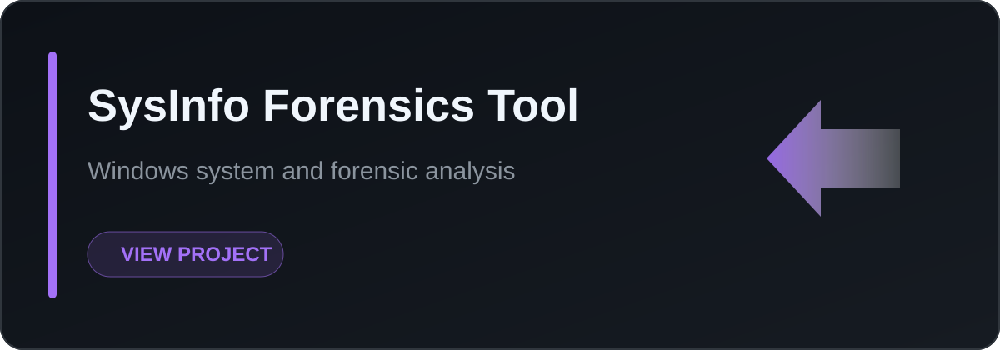
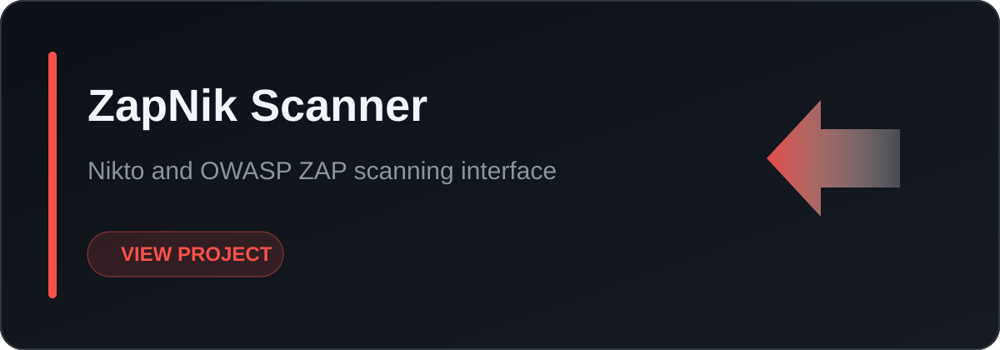
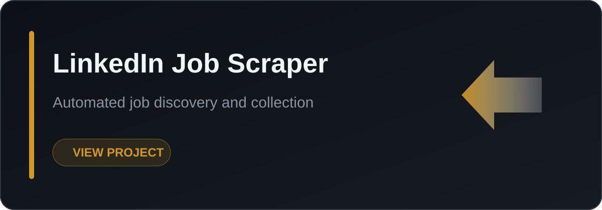

 

 

### I think like an attacker, design like a defender, and ship like an engineer.

---

## 🛡️ PhantomBox: Resource-Efficient Malware Analysis Sandbox

  
A cutting-edge, evasive-resistant environment engineered to precisely capture modern malware behavior.

  
  
  

-   **Anti-Virtualization Detection**: Advanced mechanisms to bypass VM environment checks, ensuring robust capture of even the most evasive malware samples.
-   **User-Activity Simulation**: Intelligently mimics human interaction (mouse movements, keystrokes, application usage) to neutralize sophisticated sandbox-evasion techniques.
-   **Live Monitoring Dashboard**: Provides real-time observation, detailed logging, and verifiable insights into malicious activities within a secure, controlled environment.

---

## 🚀 Featured Builds

  <table width="100%" border="0" cellspacing="0" cellpadding="0">
    <tr>
      <td width="50%" align="center">
        
      </td>
      <td width="50%" align="center">
        
      </td>
    </tr>
    <tr>
      <td width="50%" align="center">
        
      </td>
      <td width="50%" align="center">
        
      </td>
    </tr>
    <tr>
      <td width="50%" align="center">
        
      </td>
      <td width="50%" align="center">
        
      </td>
    </tr>
  </table>

---

## 🛠️ Core Toolchain & Expertise

  
   
  
<b>Specialized Security Tools:</b> Nmap · Wireshark · Burp Suite · Nikto · OWASP ZAP

---

## 📊 GitHub Ecosystem

  
  
  
    
  
  <picture>
    <source media="(prefers-color-scheme: dark)" srcset="https://raw.githubusercontent.com/arslanjv/arslanjv/output/github-contribution-grid-snake-dark.svg"/>
    <source media="(prefers-color-scheme: light)" srcset="https://raw.githubusercontent.com/arslanjv/arslanjv/output/github-contribution-grid-snake.svg"/>
    
  </picture>

---

  

