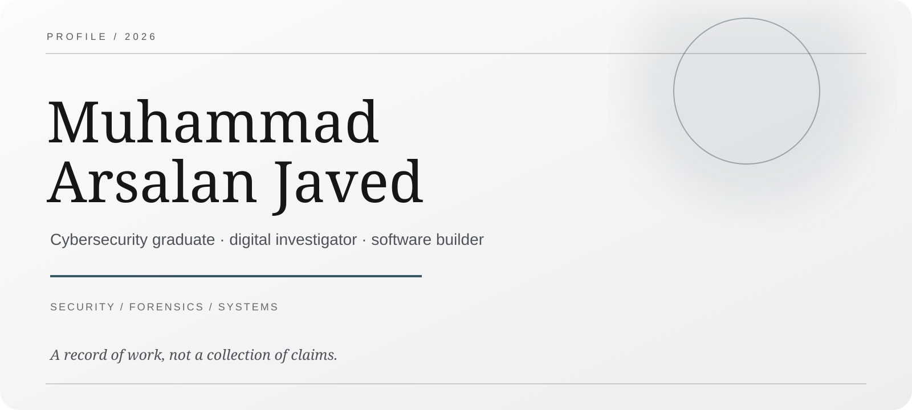
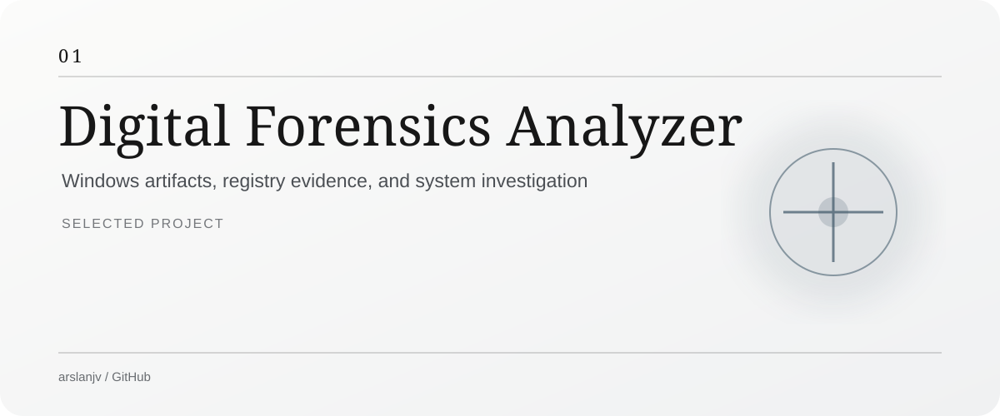
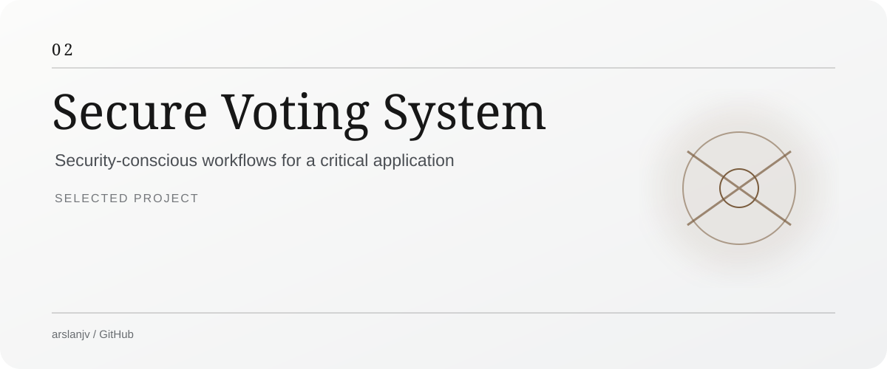
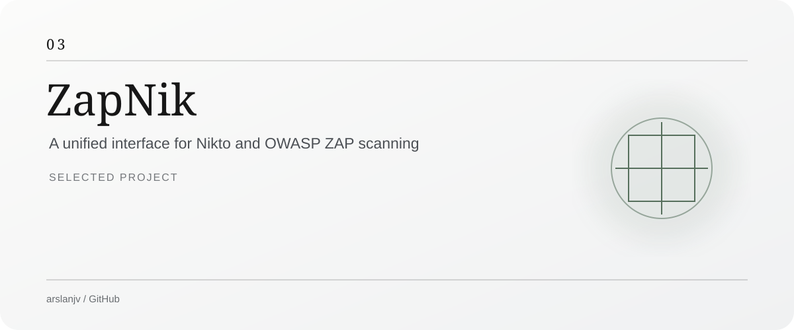
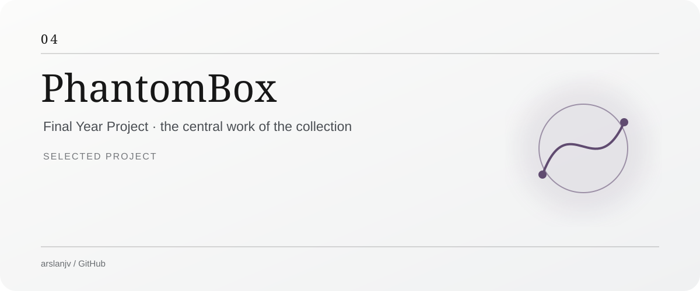

  

  

 

<!--
This profile is intentionally quiet.
No skill bars. No trophy wall. No random logo cemetery.
-->

  

<h2 align="center">Selected work</h2>

  Projects shaped around investigation, secure systems, and practical software.

  

  

  

  

 

  

<h2 align="center">Practice</h2>

<table align="center">
<tr>
<td width="50%" valign="top">

### Security

Ethical Hacking  
Network Security  
Digital Forensics  
Vulnerability Assessment  
Secure Application Design

</td>
<td width="50%" valign="top">

### Engineering

Python · Flask  
JavaScript · HTML · CSS  
C++ · SQL · PostgreSQL  
Git · GitHub · PowerShell

</td>
</tr>
</table>

 

  

<h2 align="center">A record of the work</h2>

  

<b>Contribution trail</b>

 

  

 

  

