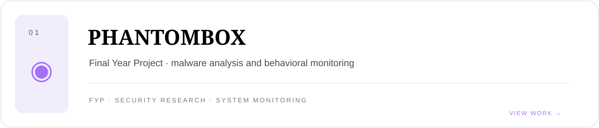
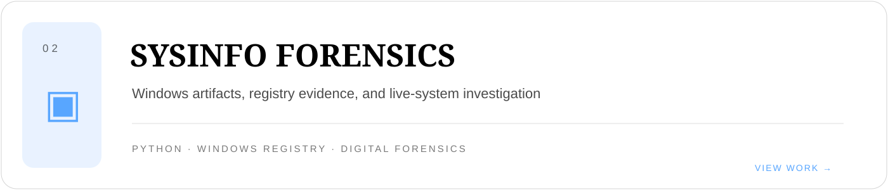
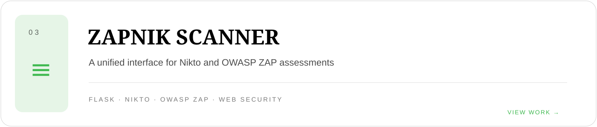
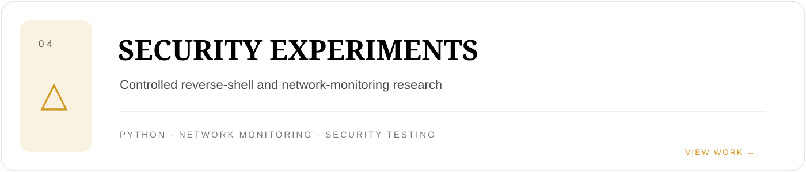

<a href="https://github.com/arslanjv?tab=repositories">REPOSITORIES</a> ·
<a href="https://github.com/arslanjv?tab=stars">STARRED</a>

## SELECTED WORK

A focused record of security engineering, digital investigation, and practical software. No skill bars. No trophy wall. No decorative logo cemetery.

## DISCIPLINES

| SECURITY | ENGINEERING | INVESTIGATION |
|:--|:--|:--|
| Ethical Hacking | Python · Flask | Digital Forensics |
| Network Security | JavaScript · HTML · CSS | Windows Registry Analysis |
| Vulnerability Assessment | C++ · SQL · PostgreSQL | System Artifact Collection |
| Web Security Testing | Git · GitHub · PowerShell | Malware Behavior Research |

## ACTIVITY

<b>Contribution trail</b>

 

Designed as a record of work. Built for GitHub, not a fake portfolio website.

